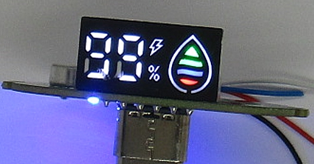

variant=standard
id=hw001

# Hardware

This project re-uses the **SY-D66Q-LED** display module commonly found in disposable vapes.
The module is a compact charlieplexed LED display featuring:

* Two 7-segment digits (0–99)
* Percent icon
* Charging/thunder icon
* 4-step battery level indicator
* Drop symbol, can be white or multicolor

All LEDs are controlled using only **6 GPIO pins**.

---

## Example build


Typical setup using an Arduino Nano and six series resistors.
Each display line **must** be current limited.

---

## Display module



The module is usually marked:

* `SY-D66Q-LED`
* production code such as `20250807SYK`

Different batches may use slightly different internal mappings.
The mapping used in this project was determined by manual scanning.

---

## Original application


This type of display is found in many disposable vape devices.
The goal of this project is to **give these displays a second life** in DIY electronics such as:

* Battery monitors
* Power banks
* Charger interfaces
* Energy meters (e.g., LTC2944 based)

---

## Electrical interface

The display uses **charlieplexing (LOW → HIGH convention)**:

* First digit in an AB code → driven **LOW**
* Second digit → driven **HIGH**
* All other pins → **INPUT (Hi-Z)**

Example:

```
43  →  pin 4 LOW, pin 3 HIGH
```

### Required components

* 6× series resistors (typically 220–1kΩ)
* 6 GPIO pins from the microcontroller
* 3.3V or 5V compatible MCU

---

## Notes & warnings

* Never connect the display directly without resistors
* Only one LED must be active at a time via the driver
* Pin order in `DISPLAY_PINS[]` must match your wiring
* Revisions of the module may differ → remap if needed

---

If you discover a different hardware revision, please share your mapping in a pull request so others can reuse it.
